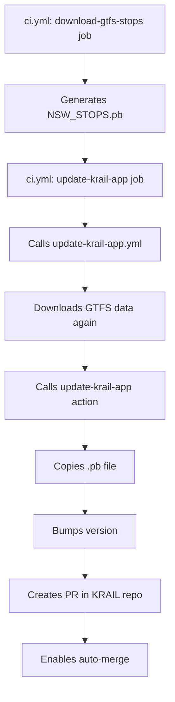

# GitHub Actions Architecture

This document explains the organization and structure of GitHub Actions workflows in this repository.

## Overview

The workflows are organized following GitHub Actions best practices:

1. **Composite Actions** - Reusable action logic in `.github/actions/`
2. **Reusable Workflows** - Sharable workflows in `.github/workflows/`
3. **Main Workflows** - Entry point workflows that orchestrate everything

## Structure

```
.github/
├── actions/
│   ├── gradle-build/           # Gradle build composite action
│   │   └── action.yml
│   └── update-krail-app/       # KRAIL app update composite action
│       ├── action.yml
│       └── README.md
└── workflows/
    ├── ci.yml                  # Main CI workflow (orchestrator)
    └── update-krail-app.yml    # Reusable workflow for KRAIL updates
```

## Workflows

### 1. Main CI Workflow (`ci.yml`)

**Purpose:** Main orchestrator for all CI/CD processes

**Triggers:**
- Push to `main` branch
- Pull requests
- Schedule (every 5 days at midnight UTC)
- Manual dispatch

**Jobs:**
- `pr-checks` - Validates pull requests
- `pr-validation` - Runs PR validation checks
- `download-gtfs-stops` - Downloads and processes GTFS data
- `update-krail-app` - Calls reusable workflow to update KRAIL repo

**Key Features:**
- Minimal logic, mostly orchestration
- Calls composite actions and reusable workflows
- Clean and easy to understand

### 2. Update KRAIL App Workflow (`update-krail-app.yml`)

**Purpose:** Reusable workflow for updating the KRAIL app repository

**Type:** `workflow_call` (reusable workflow) + `workflow_dispatch` (manual trigger)

**Triggers:**
- Called from other workflows (`workflow_call`)
- Manual trigger from Actions tab (`workflow_dispatch`)

**Inputs:**
- `krail-repo` - Target repository (default: `ksharma-xyz/Krail`)
- `java-version` - Java version to use (default: `21`)

**Secrets:**
- `NSW_TRANSPORT_API_KEY` - API key for NSW Transport
- `APP_ID` - GitHub App ID
- `APP_PRIVATE_KEY` - GitHub App private key

**Outputs:**
- `pr-created` - Whether a PR was created
- `pr-url` - URL of the created PR
- `pr-number` - PR number

**Usage (as reusable workflow):**
```yaml
update-krail-app:
  uses: ./.github/workflows/update-krail-app.yml
  secrets:
    NSW_TRANSPORT_API_KEY: ${{ secrets.NSW_TRANSPORT_API_KEY }}
    APP_ID: ${{ secrets.APP_ID }}
    APP_PRIVATE_KEY: ${{ secrets.APP_PRIVATE_KEY }}
```

**Usage (manual trigger):**
Go to Actions → "Update KRAIL App with GTFS Data" → Click "Run workflow"

## Composite Actions

### 1. Gradle Build Action (`gradle-build/`)

**Purpose:** Handles Gradle build operations

**Location:** `.github/actions/gradle-build/`

### 2. Update KRAIL App Action (`update-krail-app/`)

**Purpose:** Updates the KRAIL repository with latest GTFS data

**Location:** `.github/actions/update-krail-app/`

**What it does:**
1. Verifies `.pb` file exists
2. Checks out KRAIL repository
3. Copies `NSW_STOPS.pb` to correct location
4. Bumps `NSW_STOPS_VERSION` constant
5. Creates PR with both changes
6. Enables auto-merge

**Usage:**
```yaml
- uses: ./.github/actions/update-krail-app
  with:
    github-token: ${{ secrets.GITHUB_TOKEN }}
    run-number: ${{ github.run_number }}
```

See [update-krail-app/README.md](./actions/update-krail-app/README.md) for detailed documentation.

## Benefits of This Architecture

### 1. **Separation of Concerns**
- Each component has a single, well-defined responsibility
- Logic is separated from orchestration
- Easy to understand what each piece does

### 2. **Reusability**
- Composite actions can be used in multiple workflows
- Reusable workflows can be called from different repositories
- No code duplication

### 3. **Maintainability**
- Changes to logic are isolated to specific files
- Main workflow remains clean and readable
- Easy to test individual components

### 4. **Testability**
- Reusable workflows can be triggered independently
- Composite actions can be tested in isolation
- Manual workflow dispatch for testing

### 5. **Scalability**
- Easy to add new workflows or actions
- Can extend functionality without modifying existing code
- Clear structure makes onboarding easier

## How to Add a New Workflow

### Adding a Composite Action

1. Create a new directory in `.github/actions/`
2. Add `action.yml` with the action definition
3. Document inputs, outputs, and usage in a README
4. Use the action in your workflows

```yaml
- uses: ./.github/actions/my-action
  with:
    input1: value1
```

### Adding a Reusable Workflow

1. Create a new file in `.github/workflows/`
2. Define the workflow with `workflow_call` trigger
3. Specify inputs, secrets, and outputs
4. Call it from other workflows

```yaml
my-job:
  uses: ./.github/workflows/my-workflow.yml
  secrets:
    MY_SECRET: ${{ secrets.MY_SECRET }}
```

## Example: Update Flow

Here's how the KRAIL update process works:



## Best Practices Followed

✅ **DRY (Don't Repeat Yourself)** - Reusable components instead of copy-paste  
✅ **Single Responsibility** - Each component does one thing well  
✅ **Descriptive Naming** - Clear names that explain purpose  
✅ **Documentation** - README files for complex actions  
✅ **Error Handling** - Validation and error messages  
✅ **Outputs** - Actions provide useful outputs for downstream jobs  
✅ **Defaults** - Sensible defaults for optional inputs  
✅ **Idempotency** - Safe to run multiple times  

## Troubleshooting

### Workflow fails at KRAIL update step

Check:
1. GitHub App has access to both repositories
2. `.pb` file was generated successfully
3. File paths in KRAIL repo match expectations

### Version bump fails

Check:
1. `SandookPreferences.kt` file exists at expected path
2. File contains `const val NSW_STOPS_VERSION = <number>L` pattern
3. Permissions are correct for file modification

### PR not created

Check:
1. Changes were detected in the files
2. No existing PR with `auto-generated-gtfs` label is open
3. GitHub token has PR creation permissions

## Further Reading

- [GitHub Actions: Creating a composite action](https://docs.github.com/en/actions/creating-actions/creating-a-composite-action)
- [GitHub Actions: Reusing workflows](https://docs.github.com/en/actions/using-workflows/reusing-workflows)
- [GitHub Actions: Best practices](https://docs.github.com/en/actions/security-guides/security-hardening-for-github-actions)

