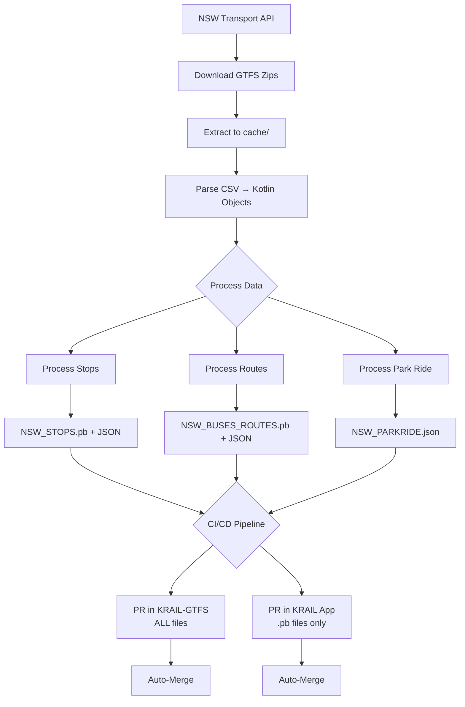

# CI/CD Pipeline

## Overview

Automated workflow that generates GTFS data and deploys it to the KRAIL mobile app repository via Pull Requests.

**Trigger Behavior:**
- **Push to main** - Runs build and tests only (no GTFS refresh or KRAIL updates)
- **Schedule (every 5 days)** - Runs full pipeline: build → GTFS refresh → KRAIL update
- **Manual dispatch** - Runs full pipeline: build → GTFS refresh → KRAIL update

---

## Complete CI Process Flow

**Every 5 days, the automated workflow performs the following:**

1. **Downloads GTFS data** from NSW Transport API
2. **Generates files** in the `cache/` directory:
   - `NSW_STOPS.pb` (Protobuf for mobile app)
   - `NSW_BUSES_ROUTES.pb` (Protobuf for mobile app)
   - `NSW_STOPS.json` + `NSW_STOPS_PRETTY.json`
   - `NSW_BUSES_ROUTES.json` + `NSW_BUSES_ROUTES_PRETTY.json`
   - `NSW_PARKRIDE.json` + `NSW_PARKRIDE_PRETTY.json`

3. **Creates PR in KRAIL-GTFS** (this repository):
   - Moves all JSON files to `nswstops/` directory
   - Moves park ride files to `nswstops/parkride/`
   - Includes `.pb` files for version control
   - **Auto-merges** after creation

4. **Creates PR in KRAIL app** repository:
   - Copies **ONLY** `.pb` files:
     - `NSW_STOPS.pb`
     - `NSW_BUSES_ROUTES.pb`
   - Bumps version constants:
     - `NSW_STOPS_VERSION`
     - `NSW_BUS_ROUTES_VERSION`
   - **Auto-merges** after CI checks pass

**Result:** Both repositories stay in sync automatically every 5 days.

---

## Workflow Architecture

```
┌─────────────────────────────────────────────────────┐
│ GitHub Actions Trigger                              │
│ - Schedule: Every 5 days at 13:00 UTC              │
│ - Manual: workflow_dispatch                         │
└──────────────────┬──────────────────────────────────┘
                   │
                   ▼
┌─────────────────────────────────────────────────────┐
│ Step 1: Generate GTFS Data                          │
│ - Checkout KRAIL-GTFS repo                          │
│ - Run ./gradlew runKRAIL-GTFS                       │
│ - Produces: cache/*.pb, *.json files                │
└──────────────────┬──────────────────────────────────┘
                   │
                   ▼
┌─────────────────────────────────────────────────────┐
│ Step 2: Verify Generated Files                      │
│ - Check NSW_STOPS.pb exists                         │
│ - Check NSW_BUSES_ROUTES.pb exists                  │
│ - Validate file sizes                               │
└──────────────────┬──────────────────────────────────┘
                   │
           ┌───────┴───────┐
           │               │
           ▼               ▼
┌──────────────────┐  ┌──────────────────────────────┐
│ Step 3a:         │  │ Step 3b:                     │
│ PR in KRAIL-GTFS │  │ PR in KRAIL App              │
│                  │  │                              │
│ - Move to        │  │ - Copy ONLY .pb files        │
│   nswstops/      │  │ - Bump versions:             │
│ - ALL files:     │  │   * NSW_STOPS_VERSION        │
│   * .json        │  │   * NSW_BUS_ROUTES_VERSION   │
│   * .pb          │  │ - Create PR                  │
│   * parkride/    │  │ - Auto-merge                 │
│ - Auto-merge     │  │                              │
└──────────────────┘  └──────────────────────────────┘
```

---

## Data Flow

Below is the high-level data flow for GTFS processing (Mermaid diagram). Use `mkdocs serve` locally to preview; the `mkdocs-material` theme supports Mermaid when `pymdownx.superfences` and `pymdownx.snippets` are enabled in `mkdocs.yml`.



---

## Workflows

### 1. `update-krail-app.yml`

**Location:** `.github/workflows/update-krail-app.yml`

**Purpose:** Main workflow that orchestrates GTFS data generation and deployment

**Triggers:**
- `workflow_call` - Called by scheduled-tasks workflow
- `workflow_dispatch` - Manual trigger with inputs

**Key Steps:**

#### Download/Generate GTFS Data
```yaml
- name: Download GTFS artifacts (if available)
  uses: actions/download-artifact@v7
  continue-on-error: true
  with:
    name: generated-json-files
    path: cache

- name: Generate GTFS Data (fallback)
  if: steps.download-artifact.outcome != 'success'
  run: ./gradlew runKRAIL-GTFS
```

**Logic:**
- Tries to use cached artifacts from scheduled workflow
- Falls back to generating fresh data if artifacts unavailable/expired

#### Verify Files
```yaml
- name: Verify PB files exist
  run: |
    # Check NSW_STOPS.pb
    if [ ! -f "cache/NSW_STOPS.pb" ]; then
      echo "❌ ERROR: NSW_STOPS.pb not found!"
      exit 1
    fi
    
    # Check NSW_BUSES_ROUTES.pb
    if [ ! -f "cache/NSW_BUSES_ROUTES.pb" ]; then
      echo "❌ ERROR: NSW_BUSES_ROUTES.pb not found!"
      exit 1
    fi
```

**Validation:**
- Ensures both `.pb` files were generated successfully
- Fails workflow if files missing

#### Deploy to KRAIL App
```yaml
- name: Update KRAIL App
  uses: ./.github/actions/update-krail-app
  with:
    krail-repo: 'ksharma-xyz/Krail'
    stops-pb-file-path: cache/NSW_STOPS.pb
    routes-pb-file-path: cache/NSW_BUSES_ROUTES.pb
    run-number: ${{ github.run_number }}
```

---

### 2. `update-krail-app` Action

**Location:** `.github/actions/update-krail-app/action.yml`

**Purpose:** Reusable action that creates PR in KRAIL app repository

**Inputs:**
```yaml
stops-pb-file-path: 'cache/NSW_STOPS.pb'
routes-pb-file-path: 'cache/NSW_BUSES_ROUTES.pb'
target-stops-pb-path: 'io/gtfs/src/commonMain/composeResources/files/NSW_STOPS.pb'
target-routes-pb-path: 'io/gtfs/src/commonMain/composeResources/files/NSW_BUSES_ROUTES.pb'
preferences-file-path: 'sandook/src/commonMain/kotlin/xyz/ksharma/krail/sandook/SandookPreferences.kt'
```

**Steps:**

#### 1. Copy Protobuf Files
```bash
# Copy stops .pb file
cp cache/NSW_STOPS.pb krail-app/io/gtfs/.../NSW_STOPS.pb

# Copy routes .pb file
cp cache/NSW_BUSES_ROUTES.pb krail-app/io/gtfs/.../NSW_BUSES_ROUTES.pb
```

#### 2. Bump Versions
```bash
# Extract current NSW_STOPS_VERSION
CURRENT_STOPS_VERSION=$(grep -o 'const val NSW_STOPS_VERSION = [0-9]*L' SandookPreferences.kt | grep -o '[0-9]*')

# Extract current NSW_BUS_ROUTES_VERSION
CURRENT_ROUTES_VERSION=$(grep -o 'const val NSW_BUS_ROUTES_VERSION = [0-9]*L' SandookPreferences.kt | grep -o '[0-9]*')

# Increment both versions
NEW_STOPS_VERSION=$((CURRENT_STOPS_VERSION + 1))
NEW_ROUTES_VERSION=$((CURRENT_ROUTES_VERSION + 1))

# Update file
sed -i "s/const val NSW_STOPS_VERSION = ${CURRENT_STOPS_VERSION}L/const val NSW_STOPS_VERSION = ${NEW_STOPS_VERSION}L/" SandookPreferences.kt
sed -i "s/const val NSW_BUS_ROUTES_VERSION = ${CURRENT_ROUTES_VERSION}L/const val NSW_BUS_ROUTES_VERSION = ${NEW_ROUTES_VERSION}L/" SandookPreferences.kt
```

**Example:**
```kotlin
// Before
const val NSW_STOPS_VERSION = 32L
const val NSW_BUS_ROUTES_VERSION = 5L

// After
const val NSW_STOPS_VERSION = 33L
const val NSW_BUS_ROUTES_VERSION = 6L
```

#### 3. Check for Changes
```bash
git diff --quiet NSW_STOPS.pb NSW_BUSES_ROUTES.pb SandookPreferences.kt
if [ $? -eq 0 ]; then
  echo "No changes detected - skipping PR"
else
  echo "Changes detected - creating PR"
fi
```

**Logic:**
- Only creates PR if files actually changed
- Prevents empty PRs

#### 4. Create Pull Request
```bash
gh pr create \
  --title "Update NSW GTFS data (stops + routes)" \
  --body "Auto-generated update of NSW GTFS Protobuf files
  
**Changes:**
- Updated NSW_STOPS.pb with latest GTFS stops data
- Updated NSW_BUSES_ROUTES.pb with latest route-to-stops mappings
- Bumped NSW_STOPS_VERSION to **${NEW_VERSION}**

**What's included:**
- 🚏 Stops data: All NSW transport stops with coordinates
- 🚌 Routes data: Bus route numbers mapped to their stop sequences" \
  --label "auto-generated-gtfs" \
  --base main
```

**PR Example:**
```
Title: Update NSW GTFS data (stops + routes)

Body:
Auto-generated update from KRAIL-GTFS repository.

Changes:
- Updated NSW_STOPS.pb (37,738 stops)
- Updated NSW_BUSES_ROUTES.pb (4,702 routes)
- Bumped NSW_STOPS_VERSION to 33
- Bumped NSW_BUS_ROUTES_VERSION to 6

Labels: auto-generated-gtfs
```

#### 5. Enable Auto-Merge
```bash
gh pr merge $PR_NUMBER --auto --squash
```

**Behavior:**
- PR merges automatically when all checks pass
- Uses squash merge to keep history clean

---

## Dual Pull Request Strategy

The CI pipeline creates **two separate pull requests** to keep repositories in sync:

### PR #1: KRAIL-GTFS Repository (This Repo)

**Created by:** `scheduled-tasks` job in `ci.yml`

**Files included:**
```
nswstops/NSW_STOPS.json
nswstops/NSW_STOPS_PRETTY.json
nswstops/NSW_STOPS.pb
nswstops/NSW_BUSES_ROUTES.json
nswstops/NSW_BUSES_ROUTES_PRETTY.json
nswstops/NSW_BUSES_ROUTES.pb
nswstops/parkride/NSW_PARKRIDE.json
nswstops/parkride/NSW_PARKRIDE_PRETTY.json
```

**Purpose:**
- Keep version-controlled copy of all GTFS data
- JSON files for debugging and manual inspection
- Park & Ride data stored in this repo only
- `.pb` files for historical tracking

**Auto-merge:** ✅ Yes - merges immediately after creation

---

### PR #2: KRAIL App Repository

**Created by:** `update-krail-app` workflow

**Files included:**
```
io/gtfs/src/commonMain/composeResources/files/NSW_STOPS.pb
io/gtfs/src/commonMain/composeResources/files/NSW_BUSES_ROUTES.pb
sandook/src/commonMain/kotlin/xyz/ksharma/krail/sandook/SandookPreferences.kt
```

**Purpose:**
- Update mobile app with latest GTFS data
- Only `.pb` (Protobuf) files needed for app
- Bump version constants for cache invalidation:
  - `NSW_STOPS_VERSION`
  - `NSW_BUS_ROUTES_VERSION`

**Auto-merge:** ✅ Yes - merges after CI checks pass

---

### Why Two PRs?

| Aspect | KRAIL-GTFS Repo | KRAIL App Repo |
|--------|----------------|----------------|
| **File Format** | JSON + Protobuf | Protobuf only |
| **Park & Ride** | ✅ Included | ❌ Not needed |
| **Version Bump** | ❌ No versioning | ✅ Bumps constants |
| **Use Case** | Data storage & debugging | Mobile app runtime |
| **Size** | Larger (all formats) | Smaller (optimized) |

**Result:** Clean separation of concerns - data repository vs. application deployment.

---

## Authentication

### GitHub App Token

**Why:** Standard GITHUB_TOKEN doesn't trigger workflows in target repo

**Solution:** Uses GitHub App for authentication
```yaml
- name: Generate GitHub App Token
  uses: actions/create-github-app-token@v2
  with:
    app-id: ${{ secrets.APP_ID }}
    private-key: ${{ secrets.APP_PRIVATE_KEY }}
    repositories: KRAIL-GTFS,Krail
```

**Permissions:**
- `contents: write` - Push to branches
- `pull-requests: write` - Create/manage PRs

---

## Secrets Required

| Secret | Purpose |
|--------|---------|
| `NSW_TRANSPORT_API_KEY` | Download GTFS data from NSW Transport |
| `APP_ID` | GitHub App ID for authentication |
| `APP_PRIVATE_KEY` | GitHub App private key |

---

## Error Handling

### Missing Files
```yaml
if [ ! -f "cache/NSW_STOPS.pb" ]; then
  echo "ERROR: NSW_STOPS.pb not found!"
  exit 1
fi
```
**Result:** Workflow fails, no PR created

### Existing PR
```bash
existing=$(gh pr list --label auto-generated-gtfs --state open)
if [[ -n "$existing" ]]; then
  echo "⚠️ Found existing PR - skipping"
  exit 0
fi
```
**Result:** Skips PR creation, workflow succeeds

### No Changes
```bash
if git diff --quiet; then
  echo "No changes detected - skipping PR"
fi
```
**Result:** No PR created, workflow succeeds

---

## Schedule

**Default:** Every 5 days at 13:00 UTC (~midnight AEDT)

```yaml
on:
  schedule:
    - cron: '0 13 */5 * *'
```

**Why 13:00 UTC?**
- Approximately midnight in AEDT (UTC+11) / 2 AM in AEST (UTC+10)
- Low traffic time for Australian users
- NSW Transport data usually updates overnight
- Mobile app users unlikely to notice deployment
- Runs on days 1, 6, 11, 16, 21, 26, 31 of each month

---

## Manual Trigger

```yaml
on:
  workflow_dispatch:
    inputs:
      krail-repo:
        description: 'KRAIL repository'
        default: 'ksharma-xyz/Krail'
```

**Usage:**
1. Go to Actions tab in GitHub
2. Select "Update KRAIL App"
3. Click "Run workflow"
4. (Optional) Change target repository

---

## Outputs

### Workflow Summary
```markdown
## KRAIL App Update Summary

✅ **PR Created Successfully**

- **PR URL:** https://github.com/ksharma-xyz/Krail/pull/123
- **PR Number:** #123
- **Version Bumped To:** 43

The PR has been configured for auto-merge and will be merged once checks pass.
```

### PR Content
- **Branch:** `update-gtfs-data-{run_number}`
- **Commits:** 1 squash commit
- **Files Changed:**
  - `io/gtfs/.../NSW_STOPS.pb`
  - `io/gtfs/.../NSW_BUSES_ROUTES.pb`
  - `sandook/.../SandookPreferences.kt`

---

## Monitoring

### Success Indicators
- ✅ Workflow completes successfully
- ✅ PR created in KRAIL repository
- ✅ Auto-merge enabled
- ✅ PR merges within minutes

### Failure Scenarios
- ❌ GTFS download fails → Retry with `refresh = true`
- ❌ Files not generated → Check Main.kt logs
- ❌ PR creation fails → Check GitHub App permissions
- ❌ No changes detected → Normal, no action needed

## Docs Deployment (MkDocs)

The repository includes a dedicated workflow to build and deploy the MkDocs site to GitHub Pages.

- Workflow: `.github/workflows/deploy-docs.yml`
- Trigger: push to `main` (when `docs/**`, `mkdocs.yml` or the workflow file itself changes), or manual `workflow_dispatch`.

Key steps the workflow performs:

1. Checkout repository
2. Configure Git credentials (github-actions[bot])
3. Install `mkdocs-material` and cache dependencies
4. Run `mkdocs gh-deploy --force` to publish to `gh-pages`

See `GITHUB_PAGES_SETUP.md` for local install instructions and troubleshooting tips.

### Local preview

```bash
# If pip missing use python3 -m pip
python3 -m pip install --user mkdocs-material pymdown-extensions
# Serve locally
mkdocs serve
```

### When to run

- Use the workflow when you update `docs/` content or change `mkdocs.yml`.
- The workflow will automatically commit to the `gh-pages` branch and publish the site.

---

## Docs / Local MkDocs Notes

If you installed `mkdocs` with `python3 -m pip install --user ...` on macOS you may see the scripts installed to a user-local `bin` directory that is not on your PATH (this is the warning you saw). Add the user-local Python `bin` to your PATH so `mkdocs` and other scripts are available in new terminal sessions.

Recommended (portable) command to add to your `~/.zshrc` (works across Python versions):

```bash
# Add this line to your ~/.zshrc (one-liner):
# It prepends the user-base bin directory so user installs work without changing system python
echo 'export PATH="$(python3 -m site --user-base)/bin:$PATH"' >> ~/.zshrc
# Then reload your shell
source ~/.zshrc
```

After this, `mkdocs` (and `pip`/`pip3` user-installed scripts) should be available in new shells. Alternatively use a virtual environment to avoid changing PATH:

```bash
python3 -m venv .venv
source .venv/bin/activate
pip install mkdocs-material pymdown-extensions
mkdocs serve
```
