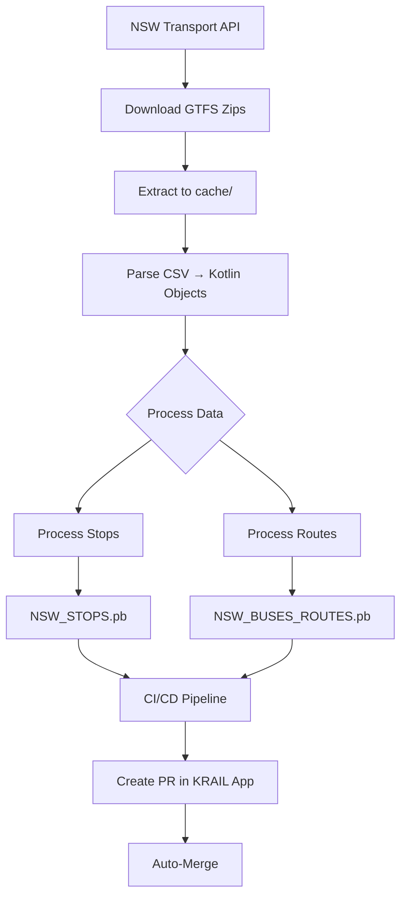

# KRAIL-GTFS Documentation

Welcome to the KRAIL-GTFS documentation. This project processes NSW GTFS (General Transit Feed Specification) data and exports it in optimized formats for the KRAIL mobile application.

## 📚 Documentation

<div class="grid cards" markdown>

- :fontawesome-solid-sitemap: **[Architecture](Architecture.md)**

    ---

    System design, components, and data flow. Learn how GTFS data is processed and the repository pattern implementation.

- :fontawesome-solid-file-code: **[GTFS Processing](GTFSProcessing.md)**

    ---

    How CSV files are parsed and transformed. Detailed walkthrough of data extraction and filtering.

- :fontawesome-solid-database: **[Data Formats](DataFormats.md)**

    ---

    JSON and Protobuf format specifications. Schema definitions and mobile app integration.

- :fontawesome-solid-rocket: **[CI/CD Pipeline](CICD.md)**

    ---

    Automated deployment workflow. GitHub Actions setup and PR creation process.

</div>

---

## 🚀 Quick Start

### Run Locally

```bash
# Download and process GTFS data
./gradlew runKRAIL-GTFS
```

### Generated Files

```
cache/
├── NSW_STOPS.pb                    # All stops (Protobuf) → Mobile app
├── NSW_BUSES_ROUTES.pb             # Route mappings (Protobuf) → Mobile app
├── NSW_STOPS.json                  # All stops (JSON) → Testing
└── NSW_BUSES_ROUTES.json           # Route mappings (JSON) → Testing
```

---

## 🏗️ Project Overview

### What is KRAIL-GTFS?

KRAIL-GTFS is a data processing pipeline that:

1. **Downloads** NSW GTFS data from Transport Open Data API
2. **Parses** CSV files into structured Kotlin objects
3. **Transforms** and optimizes for mobile app usage
4. **Exports** in JSON and Protobuf formats
5. **Deploys** automatically to KRAIL mobile app via CI/CD

### Key Features

- ✅ **Parallel Processing** - Stops and routes processed concurrently
- ✅ **Minimal Data Format** - 97% size reduction (only essential data)
- ✅ **Protobuf Export** - Fast parsing on mobile devices
- ✅ **Automated Deployment** - Daily CI/CD updates to mobile app
- ✅ **Type-Safe** - Kotlin data classes and Protobuf schemas

---

## 📊 Data Flow


